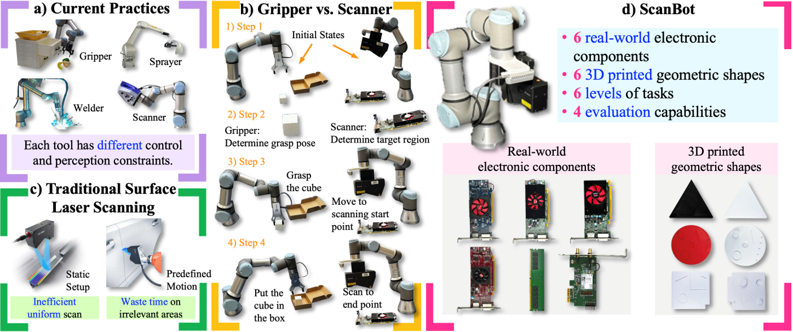

# [ScanBot: Towards Intelligent Surface Scanning in Embodied Robotic Systems](https://ed1sonchen.github.io/ScanBot/)

<!-- [](https://opensource.org/licenses/Apache-2.0) -->
[](https://ed1sonchen.github.io/ScanBot/)
<!-- [](https://arxiv.org/abs/2412.13877) -->
[](https://huggingface.co/datasets/ed1son/ScanBot)




## 🧠 Dataset Summary
**ScanBot** is a dataset for instruction-conditioned, high-precision surface scanning with robots. Unlike existing datasets that focus on coarse tasks like grasping or navigation, ScanBot targets industrial laser scanning, where sub-millimeter accuracy and parameter stability are essential. It includes scanning trajectories across 12 objects and 6 task types, each driven by natural language instructions. The dataset provides synchronized RGB, depth, laser profiles, robot poses, and joint states.


## 📦 Use Cases

- Vision-Language Action Planning (VLA)
- Instruction-Guided Surface Scanning
- 3D Surface Reconstruction
- Spatial Reasoning and Feature Localization
- Laser Profile Analysis for Inspection Tasks


## 🗂️ Data Description
```
scanbot/
├── cube1/
│   ├── top_surface/
│   │   ├── path_001/
│   │   │   ├── rgb/
│   │   │   │   └── ...
│   │   │   ├── depth/
│   │   │   │   └── ...
|   |   |   |── 1746226187.997976_gopro.mp4  
│   │   │   ├── robot_joint_states.csv
│   │   │   ├── robot_tcp_poses.csv
│   │   │   └── metadata.json
│   │   ├── path_002/
│   │   │   └── ...
├── cube2
├── cylinder_red
├── cylinder_white
└── ...
```

## 💬 Task Levels

Each scan is driven by an instruction that falls under one of the following task categories:

| Task Type | Description |
|-----------|-------------|
| T1        | Surface Scan |
| T2        | Geometry Focus |
| T3        | Spatial Reference |
| T4        | Functional Target |
| T5        | Defect Inspection |
| T6        | Comparative Analysis |

## 🛠️ Hardware Setup


## Version 1.0
The initial version of ScanBot contains 197 tasks, and involves 12 different objects.

## 👨‍💻 Todo
- [ ] Release the evaluation code
- [ ] Release the paper
- [ ] Release the curved scanning tasks